# tsf-tutcode ver. 0.3.1

Windowsで動作する漢字直接入力用のIMEです。

CorvusSKK に手を入れて以下の機能を追加しています。

* 後置型部首合成変換
* 後置型交ぜ書き変換
* 後置型カタカナ変換
* 後置型漢字→入力シーケンス変換
* 後置型入力シーケンス→漢字変換

モード無しで後置型変換を基本とするInputMethodにすることを目指しています。

## インストール


### 対応OS

* Windows Vista (32-bit / 64-bit)

    + SP2
    + [KB971644](https://support.microsoft.com/ja-jp/kb/971644) または [KB971512](https://support.microsoft.com/ja-jp/kb/971512)

* Windows 7     (32-bit / 64-bit)

    + SP1

* Windows 8     (32-bit / 64-bit)

* Windows 8.1   (32-bit / 64-bit)

* Windows 10    (32-bit / 64-bit)


### インストール

tsftutcode-X.Y.Z.exe を実行してください。 (X, Y, Z はバージョン番号)

アップデートの後はOSを再起動しておくと安全です。

インストール先

* 32bit版 Windows

    + %SystemRoot%\System32\IME\IMTSFTUTCODE

* 64bit版 Windows

    + %SystemRoot%\System32\IME\IMTSFTUTCODE
    + %SystemRoot%\SysWOW64\IME\IMTSFTUTCODE


### アンインストール

コントロールパネルの「プログラムと機能」からアンインストールしてください。

または、インストールに使用した exe ファイルを再度実行し「Uninstall」を選択してください。

アンインストールの後はOSを再起動しておくと安全です。


### 初期設定

任意のユーザーアカウントで初めて使用するときは、設定ダイアログでOKボタンを押して初期設定を保存してください。

設定ダイアログの「仮名」タブの「…」ボタンから、ローマ字・仮名変換表としてkanatable-tutcode.txtやkanatable-tcode.txtを読み込ませてください。

設定ダイアログの「辞書」タブの「追加」ボタンから、maze.dicを選択し、「取込」ボタンを押してください。

設定ダイアログで保存した後は、IME OFF → ON で新しい設定が反映されます。

続いて、設定ダイアログのSKK辞書のリストに交ぜ書き変換辞書ファイルのパスまたはURLを追加して取込ボタンを押してください。詳しくは後述の「SKK辞書」の項を参照してください。


### Windows ストアアプリ、Microsoft Edge

Windows ストアアプリ、Microsoft Edge 等で使用するには、設定ファイル (config.xml) にアクセス許可を付加させる必要があります。

Windows 8 以降で動作する設定ダイアログでOKボタンを押して保存をおこなうとアクセス許可の付加が自動的におこなわれます。

また、Windows 8 以前から Windows 8 以降へ Windows をアップグレードしたときは、tsf-tutcode を一旦アンインストールした上でインストールし直してください。

インストール時に、Windows ストアアプリ、Microsoft Edge 等で使用可能となるようにIMEの登録がおこなわれます。


### Adobe Reader X, XI, Acrobat Reader DC

Adobe Reader X 以降で使用するには、設定ファイル (config.xml) にアクセス許可を付加させる必要があります。

設定ダイアログでOKボタンを押して保存をおこなうとアクセス許可の付加が自動的におこなわれます。


## 後置型変換

後置型変換では、カーソル直前の文字列を取得して、変換後文字列に置換します。

文字列取得や削除にはTSF(Text Services Framework)を使用します。

TSFに対応していないアプリの場合は、文字列取得にIMR_DOCUMENTFEEDを、文字列削除にVK_BACK送り付けを使います。

IMR_DOCUMENTFEEDにも対応していないアプリの場合は、tsf-tutcode内部の入力済文字列バッファから文字列を取得します
(カーソルを移動すると不整合が生じます)。

### 後置型部首合成変換
2文字を合成してできる漢字に置換。

	例）「木刀」の後ろでald(Bushu機能に割り当てたシーケンス)→「梁」

### 後置型交ぜ書き変換
指定した文字数を読みとして取得し、交ぜ書き変換を開始。

	例）「急きょ」の後ろでm3(Maze3機能に割り当てたシーケンス)→「▼急遽」

	例）「国」の後ろでm1(Maze1機能)→「▼圀」確定後
	    「圀」の後ろでm1(Maze1機能)→「▼國」確定後
	    「國」の後ろでm1(Maze1機能)→「▼国」

### 後置型交ぜ書き変換(活用する語)
指定した文字数を読みとして取得し、読みに―を追加して活用する語として交ぜ書き変換を開始。

	例）  「あお」の後ろでn2(MazeK2機能。「あお―」で検索)→「▼仰」
	参考）「あお」の後ろでm2(Maze2機能)→「▼青」

### 後置型カタカナ変換
#### 指定した文字数をカタカナに置換
	例）「あぷり」の後ろでk3(Kata3機能に割り当てたシーケンス)→「アプリ」

#### 連続するひらがなをカタカナに置換
	例）「一部そーす」の後ろでk0(Kata0機能に割り当てたシーケンス)→「一部ソース」

#### 指定した文字数をひらがなとして残してカタカナに置換
	例）「一部のそーす」の後ろでj1(Kata-1機能に割り当てたシーケンス)→「一部のソース」

#### 直前の後置型カタカナ変換を縮める
	例）「例えばあぷりけーしょん」k0(Kata0機能:ひらがなが続く間カタカナに変換)
	  →「例エバアプリケーション」l2(Kata>2機能:2文字縮める)
	  →「例えばアプリケーション」

### 後置型漢字→入力シーケンス変換
指定した文字数を入力シーケンスに置換。

よく使う英単語をモード切り替えせずに打鍵して、置換をかけて英字にする用途。

なお、前後の空白は区切りを示す文字とみなして除去します。

#### 改行/タブ/空白までの文字列を取得し、入力シーケンスに置換
	例）「また ミ急駅―」の後ろで;0(KtoS0機能に割り当てたシーケンス)→「またWindows」

####  指定した文字数を入力シーケンスに置換
	例）「場st談 」の後ろで;5(KtoS5機能に割り当てたシーケンス)→「system」

### 後置型入力シーケンス→漢字変換
IMオフ状態で打鍵してしまった文字列を、後から日本語に置換する用途で使用。

#### 連続する英字
連続する英字(入力シーケンスで使われる文字)を入力シーケンスとして取得し、そのシーケンスを打鍵した場合に入力される文字列に置換

	例）「rkt4gi」の後ろでz0(StoK0機能に割り当てたシーケンス)→「あぷり」

#### 指定した文字数を漢字に置換


## 設定

### 設定ダイアログ

設定ダイアログは、以下のいずれかの操作で開くことができます。

* 言語バーを右クリックし、メニューから「設定」を選択する。「テキストサービスと入力言語」ダイアログの「インストールされているサービス」からtsf-tutcodeを選択し、プロパティボタンを押す。
* 言語バーの入力モードアイコンを左クリックし、メニューから「設定」を選択する。
* 言語バーのヘルプボタンを左クリックし、メニューから「設定」を選択する。
* Windows 8 以降の通知領域の入力モードアイコンを右クリックし、メニューから「設定」を選択する。

設定ダイアログで保存した後は、IME OFF → ON で新しい設定が反映されます。

IME ON/OFF のキーのみ、IME ON → OFF のときにも反映されます。


### 設定ファイル、SKK辞書

各種設定及び取込済SKK辞書は、ディレクトリ %AppData%\tsf-tutcode の各ファイルに保存されます。

| ファイル名 | 説明 |
|---|---|
| config.xml  | 各種設定 |
| skkdict.txt | 取込済SKK辞書 |

各種設定の config.xml ファイルは、UTF-8 の XML フォーマットのテキストファイルとなっており、テキストエディタで編集可能です。変更した後は、IME OFF → ON で新しい設定が反映されます。

取込済SKK辞書の skkdict.txt ファイルは、UTF-16 (LE, BOMあり) のSKK辞書フォーマットとなっています。


### ユーザー辞書

ユーザー辞書は、ディレクトリ %AppData%\tsf-tutcode の各ファイルに保存されます。

| ファイル名 | 説明 |
|---|---|
| userdict.txt | ユーザー辞書 |
| userdict.bk1<br>userdict.bk2<br>userdict.bk3 | ユーザー辞書バックアップ (3世代まで) |

UTF-16 (LE, BOMあり) のSKKユーザー辞書フォーマットで書き込まれます。

ユーザー辞書を直接編集する際は、ログオンユーザー権限で動作している辞書管理プロセス (imtutmgr.exe) をタスクマネージャなどで終了させた状態でおこなってください。

編集後、以下のいずれかの操作をおこなうと辞書管理プロセスが自動的に起動します。

* IME OFF → ON
* 仮名漢字変換開始
* 補完開始

辞書管理プロセスを直接実行することも可能です。

ユーザー辞書は、辞書管理プロセスの起動時にメモリ上に読み込まれ、追加、変更、削除があったとき、かつ、以下のいずれかのときに上書きされます。

* IME ON 状態から OFF 状態にするとき
* IME ON 状態のアプリケーションが終了するとき
* アプリケーションがフォーカスを失うとき
* 辞書管理プロセスが終了するとき
* スリープ、休止状態に移行するとき

ユーザー辞書バックアップは辞書管理プロセスによって以下のいずれかのときに作成されます。

* シャットダウン、再起動、ログオフ、スリープ、休止状態に移行するとき
* インストーラーによるアップデート、アンインストールで終了されるとき


### SKK辞書

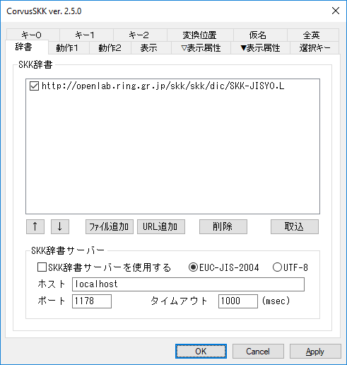

SKK辞書の詳細はこちらを参照ください。 http://openlab.jp/skk/wiki/wiki.cgi?page=FrontPage

SKK辞書ファイルの文字コードは、EUC-JIS-2004、UTF-8 (BOMなし/あり)、UTF-16 (LE, BOMあり) に対応しています。

設定ダイアログのリストに交ぜ書き変換辞書を追加し、取込ボタンを押してください。取込済SKK辞書に変換されて使用可能となります。

チェックボックスを外すと取込の対象外となります。

リストの選択されている行をクリックするとインライン編集することができます。

漢直Win等のkwmaze.dicを取込むには、文字コードをUTF-8等に変換した後、以下の2行をファイルの先頭に挿入しておいてください。

```
;; okuri-ari entries.
;; okuri-nasi entries.
```

SKK辞書のURLを追加した場合は、取込処理のときにディレクトリ %TMP%\tsf-tutcode または %TEMP%\tsf-tutcode にダウンロードされてから取り込まれます。

SKK辞書のダウンロード機能では HTTP, HTTPS が使用可能です。プロキシはOSに設定されたものが使用されます。


### SKK辞書サーバー

別途用意されたSKK辞書サーバーと通信して、skkservプロトコルのクライアントとして辞書検索をおこないます。

同時に１つのみ使用可能です。IPv4、IPv6 に対応しています。

通信に使用する文字コードは、EUC-JIS-2004、UTF-8 に対応していますが、通常のSKK辞書サーバーではデフォルトの EUC-JIS-2004 を使用してください。

サーバーコンプリーション機能は未実装です。


### 動作

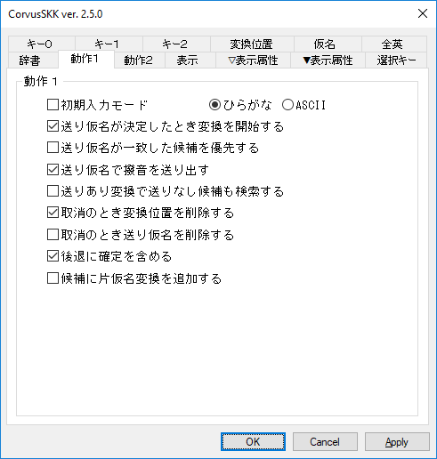

| 機能 | 備考 |
|---|---|
| 初期入力モード                       | プログラム起動時の入力モードを指定します。 |
| 送り仮名が決定したとき変換を開始する | 送り仮名を入力したとき自動的に変換を開始します。接頭辞も同様です。 |
| 送り仮名が一致した候補を優先する     | 送り仮名ブロックの送り仮名が一致する候補を優先して出力します。 |
| 送り仮名で撥音を送り出す             | 送り仮名入力開始後の変換位置指定を含む「な/にゃ」行の入力で「ん」を送り出します。<br>例) ON:「NoNO」→「▽の\*んお」/ OFF:「NoNO」→「▽の\*の」 |
| 送りあり変換で送りなし候補も検索する | 送りあり変換のとき送りありの候補に加え送りなしの候補も検索します。<br>デフォルトでサ行の活用のみ<br>init.luaのenable_skk_search_sagyo_onlyがfalseのとき全ての活用 |
| 取消のとき変換位置を削除する         | ▼モードから▽モードに遷移する際、送り仮名の位置情報を削除します。 |
| 取消のとき送り仮名を削除する         | ▼モードから▽モードに遷移する際、送り仮名の部分を削除します。 |
| 後退に確定を含める                   | ▼モードのとき後退すると一文字削除した上で確定します。<br>OFFでは▼モードのとき後退は前候補と同じ機能を有します。 |
| 候補に片仮名変換を追加する           | 見出し語を片仮名に変換した候補を追加します。 |

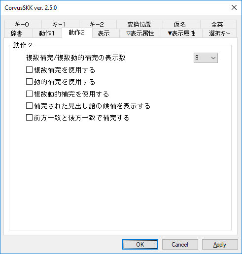

| 機能 | 備考 |
|---|---|
| 複数補完/複数動的補完の表示数        | 複数補完、複数動的補完での1ページあたりの候補数を指定します。 |
| 複数補完を使用する                   | 通常の補完のとき補完された見出し語を一覧で表示します。<br>補完対象は「候補一覧の色」の「選択」、補完部分は「候補」の色が使用されます。 |
| 動的補完を使用する                   | 見出し語が入力されたとき補完された見出し語を表示します。<br>「▽表示属性」の「\*送り」の色が使用されます。 |
| 複数動的補完を使用する               | 見出し語が入力されたとき補完された見出し語を一覧で表示します。<br>補完対象は「候補一覧の色」の「選択」、補完部分は「候補」の色が使用されます。 |
| 補完のときユーザー辞書を検索する     | 補完/複数補完/動的補完/複数動的補完のときユーザー辞書の検索結果を追加して表示します。<br>表示する候補の数は最大で「候補一覧表示に要する変換回数」-1 です。<br>補完/動的補完では「▽表示属性」の「\*送り」の色が使用されます。<br>複数補完/複数動的補完では「候補一覧の色」の「注釈」の色が使用されます。 |


###表示

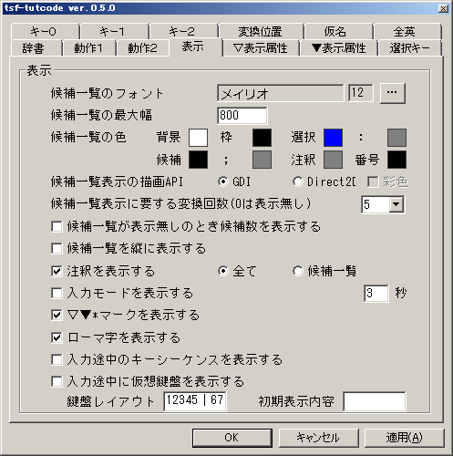

| 機能 | 備考 |
|---|---|
| 候補一覧のフォント                        | 候補一覧に表示するフォントの種類、スタイル、サイズを指定します。 |
| 候補一覧の最大幅                          | 候補一覧の最大幅のサイズを指定します。 |
| 候補一覧の色                              | 候補一覧の色を指定します。 |
| 候補一覧の描画API                         | 候補一覧の描画をおこなうAPIを指定します。<br>Direct2Dと彩色の指定でカラーフォントをその色で表示します。(Windows8.1以降) |
| 候補一覧表示に要する変換回数(0は表示無し) | 指定した回数変換すると候補一覧が表示されます。 |
| 候補一覧が表示無しのとき候補数を表示する  | (<現在の候補の番号>/<候補数>) の形式を追加して表示します。 |
| 候補一覧を縦に表示する                    | 候補一覧で候補を縦に並べて表示します。 |
| 注釈を表示する                            | <候補><セミコロン><注釈> の形式で注釈を表示します。<br>「候補一覧」の指定で候補一覧に限定されます。 |
| 入力モードを表示する                      | キャレットまたは辞書登録ウィンドウ付近に入力モードを表示します。<br>タイミングは、IME ON/OFF 変更、入力モード変更、IME ON/OFF キー押下、「\*無効\*」キー押下のときです。<br>「没入型」の指定でストアアプリやEdgeなどに限定されます。 |
| ▽▼\*マークを表示する                    | 大切なものは目に見えないようです。 |
| ローマ字を表示する                        | 仮名文字のローマ字プレフィックスを表示します。 |
| 入力途中のキーシーケンスを表示する        | 有効にすると、一部アプリで後置型変換動作に問題が生じます。 |


### 表示属性

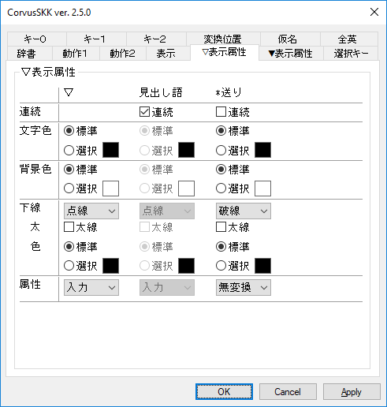

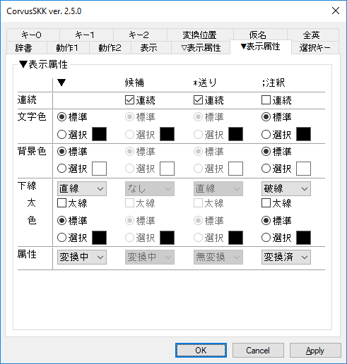

入力中文字列の表示属性を設定します。

「連続」のチェックボックスをチェックすると、表の左側の表示属性を継承し、下線は繋って表示されます。

確定入力モードでのローマ字は連続のチェックの有無に関わらず見出し語と同じ表示属性となります。

辞書削除の確認メッセージは注釈と同じ表示属性となります。


### 候補一覧選択キー

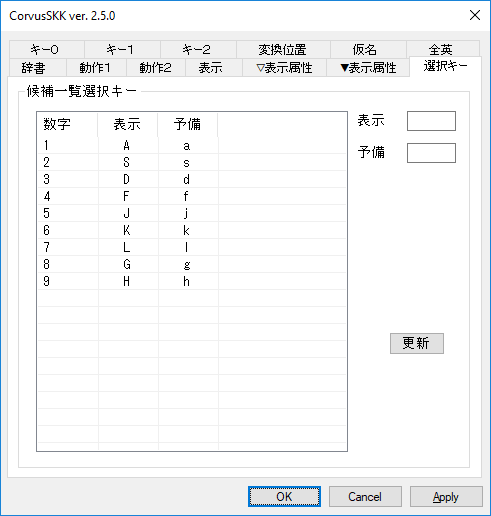

候補一覧での確定は、デフォルトで 1〜7 と ASDFJKL と asdfjkl を使用します。

コマンドプロンプト等では、デフォルトで 1〜9 と ASDFJKLGH と asdfjklgh を使用します。

候補一覧が表示されているとき、KANAキーロックは無視されます。

| 機能 | 説明 |
|---|---|
| 数字 | 選択キー (1〜9で固定) |
| 表示 | 選択キー (必須、候補一覧の表示にも使用) |
| 予備 | 選択キー (空でもOK) |


### キー設定（ON/OFF）

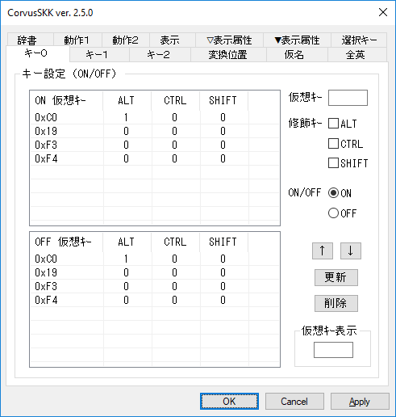

IME ON/OFF のキーをそれぞれ指定します。

仮想キーコード、Alt、Control、Shift の組合せを設定してください。

「仮想ｷｰ表示」エディットボックスにフォーカスがある状態でキー入力すると仮想キーコードを表示します。

仮想キーコードの詳細はこちらを参照ください。 https://msdn.microsoft.com/en-us/library/dd375731(v=vs.85).aspx

最大で ON/OFF それぞれ8行ずつです。

例) Ctrl+,(0xbc)でON、Ctrl+.(0xbe)でOFF。

IME ONにCtrlとの組合せを使う場合は、Windows側の設定で、キーボードレイアウトの切り替えのショートカットをCtrl+Shiftにしない方が良いです。
IME OFFにして大文字入力直後にIME ONにしようとした時に、意図せずにCtrl+Shiftを押してしまうことがあるので。

### キー設定（文字）、キー設定（仮想キー）

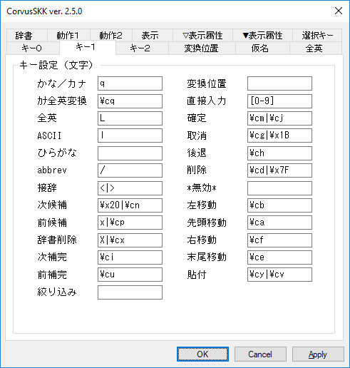

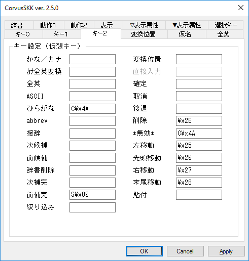

各機能に対してキーを正規表現で設定してください。

Visual C++ 2013 の 正規表現で、文法は ECMAScript を使用しています。

正規表現の詳細はこちらを参照ください。 https://msdn.microsoft.com/en-us/library/bb982727(v=vs.120).aspx

無効な正規表現で設定するとその機能は無効となります。警告等は表示されません。

キー設定（文字）とキー設定（仮想キー）とで重複する場合は、キー設定（仮想キー）のほうが優先されます。

キー設定（文字）には ASCII の範囲内の文字を設定出来ます。

キー設定（仮想キー）にはShiftキー(S)またはCtrlキー(C)をキーコードに前置することで、修飾キーを設定出来ます。

例えば、Shift+Tabであれば「S\x09」、Ctrl+Returnであれば「C\x0D」と記述します。


### キー設定デフォルト

キー設定 ON/OFF

| 機能 | キー | 備考 |
|---|---|---|
| ON / OFF  | Alt+\`                  | 0xC0 + Alt |
| 〃        | 漢字                    | 0x19 |
| 〃        | (Alt+半角/全角  Alt+\`) | 0x19 |
| 〃        | 半角/全角(Ctrl+\`)      | 0xF3, 0xF4 |

キー設定（文字）

| 機能 | キー | 備考 |
|---|---|---|
| かな／カナ |                        | ひらがな／カタカナモード、かなカナ変換 |
| ｶﾅ全英変換 |                        | ひらがな／半角カタカナモード<br>ひらがなカタカナ→半角カタカナ変換<br>abbrev→全角英数字変換 |
| 全英       |                        | 全英モード |
| ASCII      |                        | アスキーモード |
| ひらがな   |                        | ひらがなモード |
| abbrev     |                        | abbrevモード |
| 接辞       |                        | 接頭辞・接尾辞 |
| 次候補     | Space  Ctrl+n          | 辞書検索開始、次候補 |
| 前候補     | Ctrl+p                 | 「後退」のキーも使用可 |
| 辞書削除   | Ctrl+x                 | ユーザー辞書から候補を削除 |
| 次補完     | Ctrl+i(Tab)            | 補完開始、次見出し語候補 |
| 前補完     | Ctrl+u                 | 前見出し語候補 |
| 絞り込み   |                        | 候補を絞り込む見出し語の入力開始<br>skk-hint-start-char |
| 変換位置   |                        | 変換位置指定<br>2回連続入力で文字自体が確定する<br>skk-sticky-key |
| 直接入力   |                        | 見出し語入力でローマ字仮名変換しない |
| 確定       | Ctrl+m(Return)  Ctrl+j |  |
| 取消       | Ctrl+g  Ctrl+[(Escape) |  |
| 後退       | Ctrl+h(BS)             |  |
| 削除       | Ctrl+d  DEL(Ctrl+BS)   |  |
| \*無効\*   |                        | アプリケーション側に非通知<br>辞書登録の確定無効 |
| 左移動     | Ctrl+b                 |  |
| 先頭移動   | Ctrl+a                 |  |
| 右移動     | Ctrl+f                 |  |
| 末尾移動   | Ctrl+e                 |  |
| 貼付       | Ctrl+y  Ctrl+v         | クリップボードの文字列を貼り付け |
| 他IME切替  |                        | 他IMEに切り替え
| Vi Esc     |                        | アスキーモードにするとともに指定キーをアプリにも渡す

  キー設定（仮想キー）

| 機能 | キー | 備考 |
|---|---|---|
| かな／カナ |                        | ひらがな／カタカナモード、かなカナ変換 |
| ｶﾅ全英変換 |                        | ひらがな／半角カタカナモード<br>ひらがなカタカナ→半角カタカナ変換<br>abbrev→全角英数字変換 |
| 全英       |                        | 全英モード |
| ASCII      |                        | アスキーモード |
| ひらがな   |                        | ひらがなモード |
| abbrev     |                        | abbrevモード |
| 接辞       |                        | 接頭辞・接尾辞 |
| 次候補     |                        | 辞書検索開始、次候補 |
| 前候補     |                        | 「後退」のキーも使用可 |
| 辞書削除   |                        | ユーザー辞書から候補を削除 |
| 次補完     |                        | 補完開始、次見出し語候補 |
| 前補完     | Shift+0x09(Shift+Tab)  | 前見出し語候補 |
| 絞り込み   |                        | 候補を絞り込む見出し語の入力開始<br>skk-hint-start-char |
| 変換位置   |                        | 変換位置指定<br>skk-sticky-key |
| 直接入力   |                        | 見出し語入力でローマ字仮名変換しない（不使用） |
| 確定       |                        |  |
| 取消       |                        |  |
| 後退       |                        |  |
| 削除       | 0x2E (Delete)          |  |
| \*無効\*   | Ctrl+0x4A (Ctrl+j)     | アプリケーション側に非通知<br>辞書登録の確定無効 |
| 左移動     | 0x25 (カーソル左)      |  |
| 先頭移動   | 0x26 (カーソル上)      |  |
| 右移動     | 0x27 (カーソル右)      |  |
| 末尾移動   | 0x28 (カーソル下)      |  |
| 貼付       |                        | クリップボードの文字列を貼り付け |
| 他IME切替  |                        | 他IMEに切り替え
| Vi Esc     |                        | アスキーモードにするとともに指定キーをアプリにも渡す


### 半角カタカナモード

半角カタカナモードでは、ローマ字仮名変換のみ可能です。

ひらがな/カタカナへの変換、仮名漢字変換は出来ません。


### ローマ字・仮名変換表

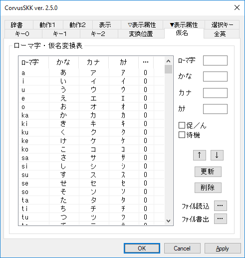

ローマ字、平仮名、片仮名、所謂半角片仮名、促音/撥音(ん)、待機の組み合せを指定します。

「促／ん」がONのとき、仮名が決定したあとに最後の入力文字が入力状態となります。

「待機」がONのとき、入力した文字をローマ字仮名変換した結果 (変換出来ないときは入力した文字そのまま) がローマ字として扱われ、辞書検索開始、確定、補完開始、ローマ字に設定されていない組み合わせ、のいずれかになるまで仮名の最終的な決定が遅延されます。

「機能」がONのとき、平仮名文字列(下表)に対応する機能を実行します。

| 平仮名文字列 | 機能 |
|---|---|
| maze    | 前置型交ぜ書き変換の読み入力開始 |
| Bushu   | 後置型部首合成変換。2文字を部首合成後の漢字に置換 |
| Help    | カーソル直前の文字の打鍵ヘルプ表示 |
| Help1   | カーソル直前の1文字の打鍵ヘルプ表示 |
| Help2   | カーソル直前の2文字の打鍵ヘルプ表示 |
| ...     | |
| Help9   | カーソル直前の9文字の打鍵ヘルプ表示 |
| Maze1   | 後置型交ぜ書き変換開始。読み1文字 |
| Maze2   | 後置型交ぜ書き変換開始。読み2文字 |
| ...     | |
| Maze9   | 後置型交ぜ書き変換開始。読み9文字 |
| MazeK1  | 後置型交ぜ書き変換開始(活用する語。読みに―を追加)。読み1文字 |
| MazeK2  | 後置型交ぜ書き変換開始(活用する語。読みに―を追加)。読み2文字 |
| ...     | |
| MazeK9  | 後置型交ぜ書き変換開始(活用する語。読みに―を追加)。読み9文字 |
| Kata0   | 後置型カタカナ変換。連続するひらがなをカタカナに置換 |
| Kata1   | 後置型カタカナ変換。1文字をカタカナに置換 |
| Kata2   | 後置型カタカナ変換。2文字をカタカナに置換 |
| ...     | |
| Kata9   | 後置型カタカナ変換。9文字をカタカナに置換 |
| Kata-1  | 後置型カタカナ変換。連続するひらがなをカタカナ置換(1文字残す) |
| Kata-2  | 後置型カタカナ変換。連続するひらがなをカタカナ置換(2文字残す) |
| ...     | |
| Kata-6  | 後置型カタカナ変換。連続するひらがなをカタカナ置換(6文字残す) |
| Kata>1  | 後置型カタカナ変換。直前のカタカナ変換を1文字縮める |
| Kata>2  | 後置型カタカナ変換。直前のカタカナ変換を2文字縮める |
| ...     | |
| Kata>6  | 後置型カタカナ変換。直前のカタカナ変換を6文字縮める |
| KtoS0   | 後置型漢字→入力シーケンス変換。改行/タブ/空白までを置換 |
| KtoS1   | 後置型漢字→入力シーケンス変換。1文字を置換 |
| KtoS2   | 後置型漢字→入力シーケンス変換。2文字を置換 |
| ...     | |
| KtoS9   | 後置型漢字→入力シーケンス変換。9文字を置換 |
| StoK0   | 後置型入力シーケンス→漢字変換。連続する英字を置換 |
| StoK1   | 後置型入力シーケンス→漢字変換。1文字を置換 |
| StoK2   | 後置型入力シーケンス→漢字変換。2文字を置換 |
| ...     | |
| StoK9   | 後置型入力シーケンス→漢字変換。9文字を置換 |

平仮名／片仮名変換では基本的に１文字ずつ変換されます。

例外として、「う゛」(う＋濁点)は「ウ゛」(ウ＋濁点)ではなく「ヴ」と変換されます。

* 例） 平仮名「きょう」を片仮名「キョウ」に変換する場合、「きょ」→「キョ」、「う」→「ウ」ではなく、「き」→「キ」、「ょ」→「ョ」、「う」→「ウ」と変換されます。

最大で32768行です。

「…」ボタンから、KanaTableファイルの読み込みと書き出しをおこなうことができます。


### KanaTableファイル

* 文字コード：UTF-16(LE,BOMあり) または UTF-8
* 改行：CR+LF または LF
* フォーマット：<ローマ字><\t><ひらがな><\t><カタカナ><\t><カタカナ(半角)><\t><[促/ん]|[待機]|[機能]><\r><\n>
    +  <ローマ字>、<ひらがな>、<カタカナ>、<カタカナ(半角)>は、それぞれUTF-16換算で最大14バイトです。
    +  [促/ん]は、ONのとき1、OFFのとき0です。
    +  [待機]は、ONのとき2、OFFのとき0です。
    +  [機能]は、ONのとき4、OFFのとき0です。
    +  <[促/ん]|[待機]|[機能]>は、[機能]がONのときは[促/ん]と[待機]は無視されます。[促/ん]と[待機]の両方がONのとき3となりますが、[待機]のほうが優先されます。 (0のときは無しでも可)
    +  空行やタブのみの行は読み飛ばされます。
    +  <\t>、<\r>、<\n>は、それぞれタブ、改行コードに読み替えてください。
* 例１）a<\t>あ<\t>ア<\t>ｱ<\r><\n>
* 例２）nn<\t>ん<\t>ン<\t>ﾝ<\t>0<\r><\n>
* 例３）np<\t>ん<\t>ン<\t>ﾝ<\t>1<\r><\n>
* 例４）ｺ<\t>こ<\t>コ<\t>ｺ<\t>2<\r><\n>
* 例５）ald<\t>Bushu<\t>-<\t>-<\t>4<\r><\n>


### ASCII・全英変換表

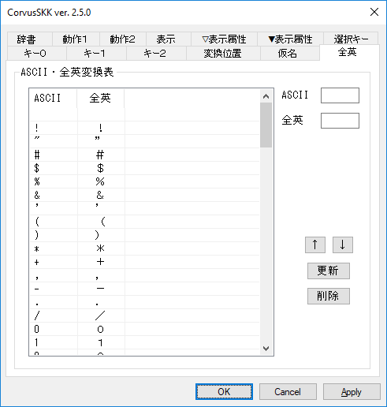

ASCII、全英文字の組み合せを指定します。最大で128行です。


## その他

### 打鍵ヘルプ表示

漢索窓を起動しておいた上で、HelpやHelp2等の機能に割り当てたシーケンスを入力すると、カーソル直前の指定文字数の打鍵ヘルプを、漢索窓に表示します。

なお、文字列が選択されている時は、選択されている文字列を対象にします。

ただし、この場合は、「入力途中のキーシーケンスを表示する」設定はオフにしておいてください。
でないと、選択文字列が入力途中のキーシーケンスで上書きされます。

なお、漢索窓にヘルプ対象文字列を渡すため、クリップボードを使います。

### Lua拡張

辞書管理プロセス (imtutmgr.exe) の各機能の拡張、プログラム実行変換もどき、数値変換をLuaスクリプトで実装しています。

現在使用しているLuaのバージョンは5.3.2です。

詳細はこちらを参照ください。http://www.lua.org/manual/5.3/manual.html

Lua内部の文字コードをUTF-8に決め打ちして、Unicode版のWindowsAPIとCランタイム関数を呼ぶようにパッチを当てています。

スクリプトファイルの文字コードはUTF-8のみに対応しています。

辞書管理プロセスのカレントディレクトリは、%AppData%\tsf-tutcode になっています。

辞書管理プロセスの起動時にスクリプトファイル (init.lua) が下記の優先順位でロードされます。

1. %AppData%\tsf-tutcode\init.lua
2. 辞書管理プロセスと同じディレクトリのinit.lua (インストーラーによりインストール済み)
  * 通常、%SystemRoot%\System32\IME\IMTSFTUTCODE\init.lua
  * または、%SystemRoot%\SysWOW64\IME\IMTSFTUTCODE\init.lua

コンソールプログラムのlua.exeが %SystemRoot%\System32\IME\IMTSFTUTCODE と %SystemRoot%\SysWOW64\IME\IMTSFTUTCODE にあるので、カスタマイズする際のデバッグ用に使ってください。


### プログラム実行変換もどき

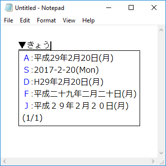

Emacs Lispのプログラム実行変換に対応していますが、あくまで「もどき」なのでご了承ください。

SKK Openlab の Emacs Lisp 辞書ファイル (SKK-JISYO.lisp) などが必要です。 http://openlab.ring.gr.jp/skk/skk/dic/SKK-JISYO.lisp

以下のシンボルに大体対応しています。

| 名称 | 説明 |
|---|---|
| nil |  |
| t |  |
| lambda |  |
| concat |  |
| substring |  |
| make-string |  |
| string-to-char |  |
| string-to-number |  |
| number-to-string |  |
| window-width | 80で固定 |
| window-height | 23で固定 |
| current-time-string |  |
| car | ほぼ skk-num-list 用 |
| cdr | ほぼ skk-num-list 用 |
| 1+ |  |
| 1- |  |
| + |  |
| - |  |
| \* |  |
| / |  |
| % |  |
| skk-version |  |
| skk-server-version |  |
| skk-gadget-units-conversion |  |
| skk-ad-to-gengo |  |
| skk-gengo-to-ad |  |
| skk-current-date |  |
| skk-default-current-date |  |
| skk-relative-date |  |
| skk-ignore-dic-word | デフォルト無効 |
| skk-omikuji | 独自実装。おみくじを引くことができます。<br>『(skk-omikuji)』 |
| fill-column | 70で固定 |
| comment-start | "/\*" |
| comment-end | "\*/" |
| skk-henkan-key | 変換する見出し語 |
| skk-num-list | 変換する見出し語に含まれる数値文字列のリスト |


### 数値変換

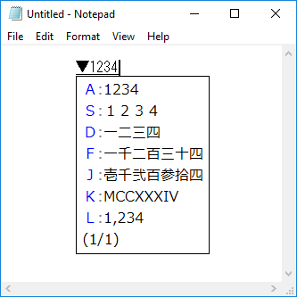

タイプ0〜3,5,8,9に対応しています。

タイプ3と5での数値は0〜10^72-1の整数に対応しています。

独自実装としてタイプ6(ローマ数字)が、1〜3999の整数に対応しています。

見出し語として # (ナンバーサイン)を含み、候補として # と数字を含むエントリが辞書に存在する必要があります。(例:「めいじ#ねん /明治#3年/」)

| 候補 | 説明 | 例 |
|---|---|---|
| #0 | タイプ０ 無変換            |「1234567890」→「1234567890」 |
| #1 | タイプ１ 全角              |「1234567890」→「１２３４５６７８９０」 |
| #2 | タイプ２ 漢数字 位取りあり |「1234567890」→「一二三四五六七八九〇」 |
| #3 | タイプ３ 漢数字 位取りなし |「1234567890」→「十二億三千四百五十六万七千八百九十」 |
| #5 | タイプ５ 大字              |「1234567890」→「拾弐億参千四百五拾六万七千八百九拾」 |
| #6 | タイプ６ ローマ数字(独自)  |「1234」→「MCCXXXIV」 |
| #8 | タイプ８ 桁区切り          |「1234567890」→「1,234,567,890」 |
| #9 | タイプ９ 将棋              |「12kin」→「１二金」 |


### Unicodeコードポイント変換

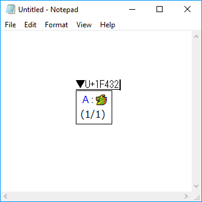

「U+XXXXXX」( コードポイント XXXXXX : 0000-FFFF または 10000-10FFFF ) または「uxxxxxx」( コードポイント xxxxxx : 0000-ffff または 10000-10ffff ) のフォーマットで変換してください。

* 例１）「▽U+30A2」→「▼ア」
* 例２）「▽u30a2」→「▼ア」


### JIS X 0213面区点番号、JIS X 0208区点番号変換

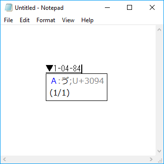

JIS X 0213では「X-YY-ZZ」( 面 X : 1-2、 区 YY : 01-94、点 ZZ: 01-94 )、JIS X 0208では「YY-ZZ」( 区 YY : 01-94、点 ZZ: 01-94 ) のフォーマットで変換してください。Unicodeコードポイントが注釈として付加されます。

* 例１）「▽1-05-02」→「▼ア;U+30A2」
* 例２）「▽05-02」→「▼ア;U+30A2」


### 文字コード表記変換

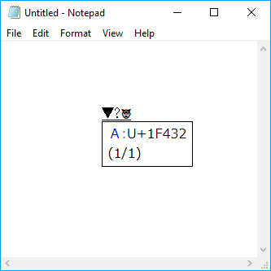

「?X」( X : 任意の1文字以上の文字列 ) のフォーマットで変換してください。

ASCII(hex), JIS X 0201(片仮名, 8bit, hex), JIS X 0213面区点番号のカンマ区切りの候補およびUnicodeコードポイントのカンマ区切りの候補に変換されます。

ASCII, JIS X 0201, JIS X 0213に変換できない文字が含まれていた場合、Unicodeコードポイントの候補のみとなります。

* 例１）「▽?ア」→「▼1-05-02」/「▼U+30A2」
* 例２）「▽?あアｱa」→「▼1-04-02,1-05-02,B1,61」/「▼U+3042,U+30A2,U+FF71,U+0061」
* 例３）「▽?🐧」→「▼U+1F427」


### 注釈の登録

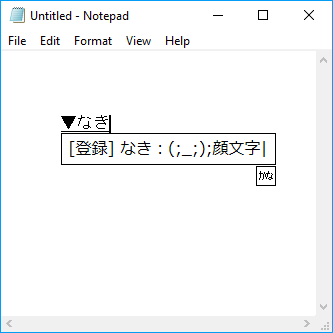

辞書登録のとき、登録する候補の入力と同時におこないます。

行頭以外の最後のセミコロン (いわゆる半角のセミコロン）以降が注釈となります。

注釈にセミコロンを含めることは出来ません。

* 例１）登録する見出し語「しょへい#ねん」、登録する候補「初平#3年」、登録する注釈「後漢」の場合
    +  「初平#3年;後漢」と入力する。

* 例２）登録する見出し語「なき」、登録する候補「(;_;)」、登録する注釈「顔文字」の場合
    +  「(;_;);顔文字」と入力する。

* 例３）登録する見出し語「せみころん」、登録する候補「;」、登録する注釈「セミコロン」の場合
    +  「;;セミコロン」と入力する。


### Windows 8, 8.1, 10 のタッチキーボード

タッチパネルを搭載したマシンでハードウェアキーボードに準拠したレイアウトを使用するには、以下の操作をおこなってください。

* Windows 8 の場合
    +  「PC設定」の画面 → 「全般」を選択 → 「タッチキーボード」の項目 → 「ハードウェアキーボードに準拠したレイアウトを使えるようにする」をオン

* Windows 8.1 の場合
    +  「PC設定」の画面 → 「PCとデバイス」の画面 → 「入力」を選択 → 「ハードウェアキーボードに準拠したレイアウトをタッチキーボードオプションとして追加する」をオン

* Windows 10 の場合
    +  「デバイス」の画面 → 「入力」を選択 → 「ハードウェアキーボードに準拠したレイアウトをタッチキーボードオプションとして追加する」をオン

タッチパネルを搭載していないマシンでハードウェアキーボードに準拠したレイアウトを使用するには、レジストリに以下の値を設定してください。

    [HKEY_CURRENT_USER\SOFTWARE\Microsoft\TabletTip\1.7]
    "EnableCompatibilityKeyboard"=dword:00000001

### 漢直Winよりもtsf-tutcodeを選ぶ状況

* Windows 8のストアアプリに入力したい場合。漢直Winでは入力不可。
* 後置型変換を多用する場合。
  漢直Winの後置型変換は、以下の点で使い勝手があまり良くない場合あり。
  tsf-tutcodeはTSFで表示中文字列を取得・置換(アプリが対応している必要あり)。
 + 内部バッファを対象とするので、表示中の文字列と不整合が生じることがあり、カーソル移動後に意図しない変換(余分な削除等)が行われることがある。
 + Backspace送り付けによる変換前文字列の削除において、遅延をある程度入れないと変換前文字列が残ることがあるが、遅延を入れすぎると待たされる。
* cp932に無い文字を使いたい場合。
  漢直Winは内部コードがcp932。
  tsf-tutcodeはUnicode(ただし後置型変換ではサロゲートペア等未対応)。

以上の状況があてはまらない場合は、漢直Winを選ぶ方が良いです。
tsf-tutcodeは未実装機能が多いため。
(ヘルプ表示、仮想鍵盤、前置型部首合成、熟語ヘルプ、ヒストリ入力、
活用する語の交ぜ書き変換、交ぜ書き変換での語幹の伸縮、強制練習モード等)

### ソースに関して

* [CorvusSKK](https://nathancorvussolis.github.io/)をベースに、以下の変更を加えています。
	+ 追加
		- 後置型部首合成変換
		- 後置型交ぜ書き変換
		- 後置型カタカナ変換
		- 後置型漢字→入力シーケンス変換
		- 後置型入力シーケンス→漢字変換
		- キーシーケンスに対する機能の割り当て: aljで交ぜ書き変換開始等
		- IME ON/OFFトグルキーのかわりに、ONにするキーとOFFにするキーをそれぞれ設定可能。(現在の状態がONかOFFかを意識しないで操作できるようにするため)
	+ 変更
		- デフォルトで入力途中のキーシーケンスを表示しないように変更(tc2同様)。一部アプリで後置型変換が正しく動作しない現象を回避するため。CorvusSKKと同じ動作をする「入力途中のキーシーケンスを表示する」設定追加
* Surrounding Text関係は、[Mozc](https://github.com/google/mozc)から一部ソースを取り込んでいます。
* 部首合成変換は、[漢直Win](https://github.com/kanchoku/kw)から一部ソースと部首合成変換辞書を取り込んでいます。
  交ぜ書き変換辞書maze.dicは、漢直Winのkwmaze.dicの漢字コードを変換して、取込みできるように;; okuri-ari entries.等を追加したものです。

### 制限事項、既知の問題

* 「入力途中のキーシーケンスを表示する」設定の場合、いくつかのアプリで後置型変換が正しく動作しない場合あり。
  例)「てすと」k3(Kata3機能)→「てストk」
 + Internet ExplorerでのWebページ内のテキスト入力フィールド
 + Windows 8のストアアプリ
 + PowerPoint 2010の検索ダイアログ
* 後置型変換での、サロゲートペアや結合文字、IVSの考慮は未対応。
* 後置型入力シーケンス→漢字変換において、後置型カタカナ変換等のシーケンスには未対応。
* 後置型カタカナ変換は、ローマ字・仮名変換表にかな・カナ対応の定義が必要:
  T-Codeの場合も、各ひらがな定義に、対応するカタカナ文字を入れておく必要があります。
* 後置型変換がExcel2010だと正常に動作しない。特に文字列末尾以外の場合。
  例)「てすと」の「と」の前でk2(Kata2機能)→「ストと」

### 開発環境

Visual Studio Community 2013 Update 5

WiX Toolset v3.10.2

pandoc 1.16.0.2

### ビルド手順

ビルド

    > installer\_solution_build.cmd
    > installer\_build.cmd

クリア

    > installer\_solution_clean.cmd
    > installer\_clean.cmd

### 履歴

#### v0.3.0 (2014-05-22)
* 辞書登録エントリ編集中の、後置型変換に対応。
* 後置型漢字→入力シーケンス変換
* 後置型入力シーケンス→漢字変換
* 活用する語の後置型交ぜ書き変換。ただし読みに「―」を追加して変換するだけ
* ASCIIモード切替キーや他IME切替キー押下時、入力途中シーケンスを確定するようにした。(ユーザの入力はなるべく捨てない)
* vi協調機能を追加。Vi Escに設定したキーが押されたらASCIIモードに切り替えるとともにアプリにも渡す。(Putty内vi操作時用)
* Ctrl等と組み合わせたキー設定(仮想キー)をCorvusSKK 1.5.7の方式に変更。
* ベースのCorvusSKKを1.6.1に更新。

#### v0.2.0 (2013-12-27)
* 打鍵ヘルプを漢索窓に表示する機能を追加:
 + 自動ヘルプ: 部首合成変換や交ぜ書き変換確定時
 + Help機能を割り当てたシーケンス入力時
* コード表に無いシーケンスはそのまま確定するオプション「ローマ字が無いとき入力を残す」を追加
  (CorvusSKKの「ローマ字が無いとき最後の入力を残す」オプションの動作変更)。
  短縮語(API,DB,OFF等)や短い英単語をそのまま入力できるようにするため。
* [SKK]モードでIME ONキーを押したら、ひらがなモードになるように修整。
  IME ONキーを押すと常にひらがなモードになる方が、
  現在どのモードかを意識しなくて良くて楽なので。
* tsf-vimとの連携用機能追加:
 + 他IMEへの切替キーを追加。
 + キー設定(仮想キー)で、CtrlやAlt等と組み合わせた設定を可能に。
* コード表ファイル(.tbl)更新
 + tutcode.tblにTouch16+の定義とTUT98.COMの拗音等の短縮ストロークを追加。
 + tcode.tblの「/4 又」の行の形式が壊れていた問題を修正。
 + 半角カナの列を全角でなく半角カナに置換
* アイコンを漢直Winのものに変更。
* ベースのCorvusSKKを1.5.3に更新。

#### v0.1.0 (2013-09-26)
* 前置型交ぜ書き変換の読み入力中の読みに対する後置型カタカナ・部首合成変換
* 後置型変換時TSF/IMR_DOCUMENTFEEDでは空の文字列しか取得できなかった場合、内部バッファを使うようにした(issue#2 への対処)。
* ベースのCorvusSKKを1.2.2に更新。

#### v0.0.3 (2013-08-29)
* 最初のリリース(自分で使う際に最低限の機能が使えるレベル)

---

Copyright (C) 2013-2016 KIHARA, Hideto
https://github.com/deton/tsf-tutcode

以下CorvusSKKのCopyright:

Copyright (C) 2011-2016 SASAKI Nobuyuki

nathancorvussolis@gmail.com

https://nathancorvussolis.github.io/
